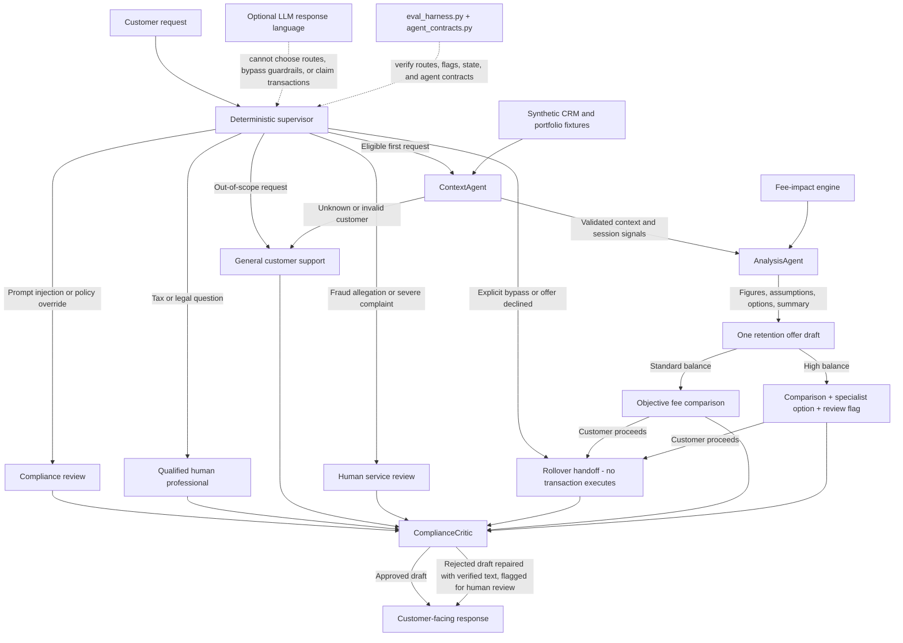

# 401(k) Rollover & Retention Multi-Agent System

A portfolio prototype for high-friction 401(k) rollover requests. A deterministic supervisor coordinates three focused agents - context, analysis, and compliance critique - over synthetic customer data, with optional LLM-generated language kept away from every routing decision.

---

## Product Strategy & Business Objectives

High-friction rollover flows often rely on dark patterns or excessive deflection, leading to customer frustration and compliance risks. This system introduces a **Trust-First Retention Framework**:

* **Transparent Value Analysis:** Uses synthetic portfolio fixtures to calculate fee comparisons and demonstrate objective account-value analysis.
* **Single-Pivot CX Guardrail:** Limits retention offers to a maximum of 1 attempt per session to eliminate user fatigue and prevent aggressive sales tactics.
* **Instant Intent Bypass:** Immediately detects explicit bypass commands ("Skip pitch", "Transfer immediately") and routes directly to a rollover handoff without friction.

---

## System Architecture

The architecture is a **multi-agent system under a deterministic supervisor**. The supervisor owns every route, state transition, and guardrail. The agents do focused work; none of them can choose a route.

1. **User Request & Intent Parsing:** The supervisor applies hard guardrails first - prompt-injection rejection, out-of-scope support routing, severe-complaint review, and tax/legal escalation - before any retention logic runs.
2. **ContextAgent (`src/agents/context_agent.py`):** Builds validated customer context from the synthetic CRM and portfolio fixtures. It refuses unknown or invalid customers (`ContextError`) and derives per-session signals (`high_balance`, `fee_sensitive`, `urgent_exit`, `tax_complexity`) from the customer's own words in the current session plus verified account data. CRM case notes and persona fixture labels never contribute to signal values.
3. **AnalysisAgent (`src/agents/analysis_agent.py`):** Runs the fee engine and returns figures, explicit assumptions, customer options, and a summary. It raises `AnalysisError` when verified analysis cannot be produced.
4. **ComplianceCritic (`src/agents/compliance_critic.py`):** Reviews every customer-facing draft on every route with deterministic rules. It rejects executed-transaction claims, tax or legal advice, retention language after a bypass, and missing synthetic/not-advice disclosures - then repairs the draft with verified text and flags human review.
5. **Supervisor Routing:** Evaluates state and guardrail rules and calls the agent pipeline only on an eligible retention turn:
   * Route to the **retention analysis** if within guardrail limits and no explicit bypass is requested.
   * Route to a **rollover handoff** if bypass is detected or the single retention attempt has been used.
   * Route to **general support** when verified customer context cannot be produced, instead of fabricating an analysis.
   * Pass every response - guardrail rejections, escalations, handoffs, and the retention offer - through the ComplianceCritic before it is returned.
6. **What-If Analysis Engine:** Calculates fee differentials and portfolio projections for clear, factual comparisons.

---

## Architecture at a Glance



The supervisor owns every allowed action and state transition. The agents supply validated context, verified analysis, and reviewed wording: every customer-facing response, on every route, passes through the ComplianceCritic before it is returned. The LLM can shape response language, but it cannot choose a route, bypass a guardrail, or execute a financial transaction.

**A note on naming:** customer-facing text and this documentation say "rollover handoff" because no transaction executes in this prototype. The internal action constant `ROUTE_TO_ROLLOVER_EXECUTION` is intentionally unchanged so the published evaluation contract keeps running; it names a routing decision, not a completed transaction.

## Repository Map

```text
401k-retention-project/
├── docs/prd.md                      # Product contract and routing policy
├── docs/demo-walkthrough.md         # Two-minute reviewer walkthrough
├── evals/eval_cases.json            # Synthetic route scenarios
├── evals/eval_harness.py            # Route, flag, and two-turn checks (9 checks)
├── evals/agent_contracts.py         # Per-agent contract checks (6 checks)
├── src/agent_system.py              # Deterministic supervisor and state transitions
├── src/agents/context_agent.py      # Context validation and session-signal derivation
├── src/agents/analysis_agent.py     # Fee-engine orchestration, assumptions, options
├── src/agents/compliance_critic.py  # Rule-based draft review and repair
├── src/analysis_engine.py           # Fee-impact calculations
├── src/connectors.py                # Synthetic CRM and portfolio fixtures
├── src/interactive_demo.py          # Reviewer-facing command-line demo
├── src/llm_client.py                # Optional Groq/OpenAI-compatible generation
└── requirements.txt                 # Reproducible Python dependencies

```

## Quick Start

```bash
python3 -m venv .venv
source .venv/bin/activate
python -m pip install -r requirements.txt
python src/interactive_demo.py
```


The demo runs with a deterministic local response fallback when GROQ_API_KEY is not configured. If a key is available in a local .env file, the optional live generation path uses Groq through the OpenAI-compatible SDK. Never commit .env files or credentials.

## Run the Evaluations

```bash
source .venv/bin/activate
python evals/eval_harness.py
python evals/agent_contracts.py
```


`eval_harness.py` verifies nine end-to-end behaviors, including explicit bypass, tax escalation, high-balance specialist flags, out-of-scope support routing, complaint/compliance routing, and the two-turn single-pivot rule. Expected final line: `EVALUATION COMPLETE: Passed: 9 | Failed: 0`.

`agent_contracts.py` verifies that each agent does distinct work: context failures route safely without a traceback, analysis figures match the fee engine exactly for every fixture, session signals are derived from the session's customer words and provably ignore fixture notes and persona labels, the critic rejects and repairs executed-transaction claims, tax advice, and missing disclosures, and every supervisor route returns only critic-reviewed responses. Expected final line: `AGENT CONTRACTS COMPLETE: Passed: 6 | Failed: 0`.

## Product Boundaries

- This is a runnable prototype using synthetic personas and portfolio data.
- It does not connect to a recordkeeper, execute a rollover, provide financial advice, or persist production workflow state. "Rollover handoff" is a routing outcome, and the retained internal constant `ROUTE_TO_ROLLOVER_EXECUTION` does not mean a transaction executed.
- Routing decisions are deterministic. LLM output changes response language, not the supervisor's allowed action.
- Unknown or unverifiable customer context routes to general support instead of producing a fabricated analysis.
- High-balance review is non-blocking: an explicit bypass still routes directly to the handoff.

## Key Files

- [docs/prd.md](./docs/prd.md) - product requirements and routing contract
- [src/agent_system.py](./src/agent_system.py) - supervisor logic and guardrails
- [src/agents/context_agent.py](./src/agents/context_agent.py) - validated context and session signals
- [src/agents/analysis_agent.py](./src/agents/analysis_agent.py) - verified fee analysis
- [src/agents/compliance_critic.py](./src/agents/compliance_critic.py) - draft review and repair
- [evals/eval_cases.json](./evals/eval_cases.json) - synthetic evaluation cases
- [evals/eval_harness.py](./evals/eval_harness.py) - end-to-end route checks
- [evals/agent_contracts.py](./evals/agent_contracts.py) - per-agent contract checks
- [docs/demo-walkthrough.md](./docs/demo-walkthrough.md) - two-minute demo walkthrough
