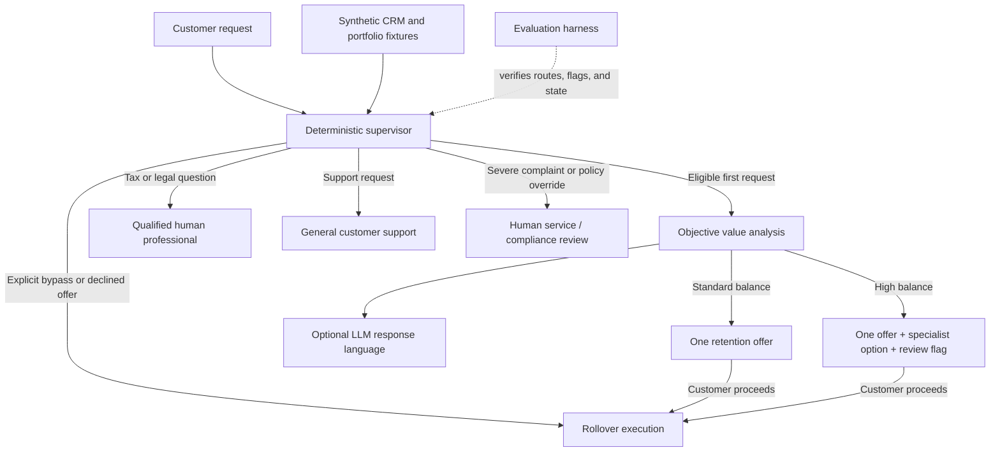

# 401(k) Rollover & Retention Multi-Agent System

A portfolio prototype for high-friction 401(k) rollover requests. It explores how deterministic routing guardrails, synthetic customer context, and optional LLM-generated language can balance retention goals with customer trust.

---

## Product Strategy & Business Objectives

High-friction rollover flows often rely on dark patterns or excessive deflection, leading to customer frustration and compliance risks. This system introduces a **Trust-First Retention Framework**:

* *Transparent Value Analysis:* Uses synthetic portfolio fixtures to calculate fee comparisons and demonstrate objective account-value analysis.
* **Single-Pivot CX Guardrail:** Limits retention offers to a maximum of 1 attempt per session to eliminate user fatigue and prevent aggressive sales tactics.
* **Instant Intent Bypass:** Immediately detects explicit bypass commands ("Skip pitch", "Transfer immediately") and routes directly to rollover execution without friction.

---

## System Architecture

The architecture uses a **Supervisor Agent** pattern with deterministic state logic:

1. **User Request & Intent Parsing:** Analyzes customer queries to determine rollover intent or explicit bypass requirements.
2. **Context Enrichment:** Fetches CRM historical data, current portfolio holdings, and allocation metrics via data connectors.
3. **Supervisor Routing:** Evaluates state and guardrail rules:
   * Route to **Retention Flow** if within guardrail limits and no explicit bypass is requested.
   * Route to **Rollover Execution** if bypass is detected or maximum retention attempts are reached.
4. **What-If Analysis Engine:** Calculates fee differentials and portfolio projections for clear, factual comparisons.

---

## Architecture at a Glance



The supervisor owns every allowed action and state transition. The LLM can shape response language, but it cannot choose a route, bypass a guardrail, or execute a financial transaction.

## Repository Map

```text
401k-retention-project/
├── docs/prd.md              # Product contract and routing policy
├── evals/eval_cases.json    # Synthetic route scenarios
├── evals/eval_harness.py    # Route, flag, and two-turn checks
├── src/agent_system.py      # Deterministic supervisor and state transitions
├── src/analysis_engine.py   # Fee-impact calculations
├── src/connectors.py        # Synthetic CRM and portfolio fixtures
├── src/interactive_demo.py  # Reviewer-facing command-line demo
├── src/llm_client.py        # Optional Groq/OpenAI-compatible generation
└── requirements.txt         # Reproducible Python dependencies

```

## Quick Start

```bash
python3 -m venv .venv
source .venv/bin/activate
python -m pip install -r requirements.txt
python src/interactive_demo.py
```


The demo runs with a deterministic local response fallback when GROQ_API_KEY is not configured. If a key is available in a local .env file, the optional live generation path uses Groq through the OpenAI-compatible SDK. Never commit .env files or credentials.

## Run the Evaluations

```bash
source .venv/bin/activate
python evals/eval_harness.py
```


The evaluation harness verifies nine behaviors, including explicit bypass, tax escalation, high-balance specialist flags, out-of-scope support routing, complaint/compliance routing, and the two-turn single-pivot rule.

## Product Boundaries

- This is a runnable prototype using synthetic personas and portfolio data.
- It does not connect to a recordkeeper, execute a rollover, provide financial advice, or persist production workflow state.
- Routing decisions are deterministic. LLM output changes response language, not the supervisor's allowed action.
- High-balance review is non-blocking: an explicit bypass still routes directly to execution.

## Key Files

- [docs/prd.md](./docs/prd.md) - product requirements and routing contract
- [src/agent_system.py](./src/agent_system.py) - supervisor logic and guardrails
- [evals/eval_cases.json](./evals/eval_cases.json) - synthetic evaluation cases
- [evals/eval_harness.py](./evals/eval_harness.py) - automated checks
- [docs/demo-walkthrough.md](./docs/demo-walkthrough.md) - two-minute demo walkthrough
