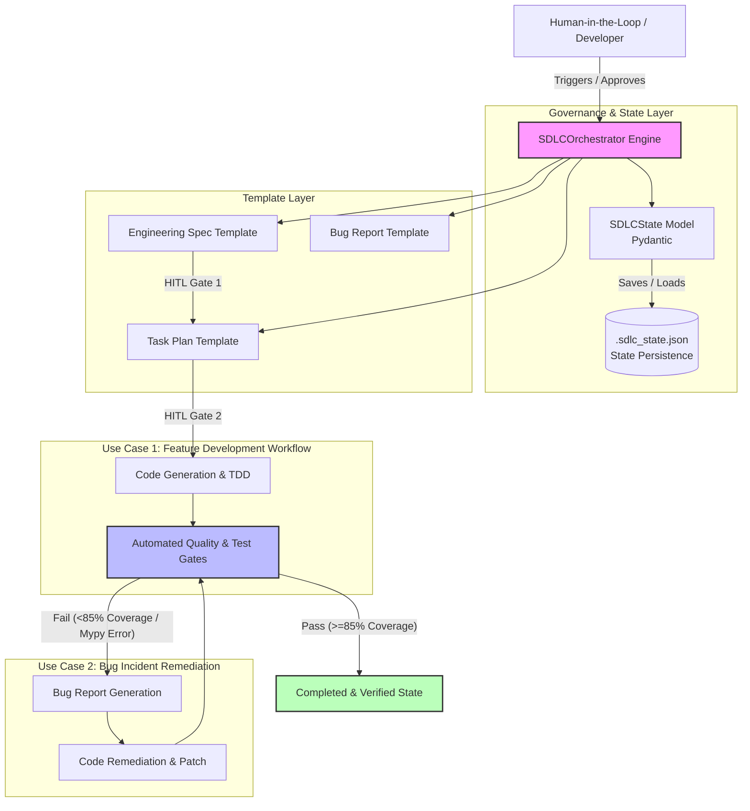

# Agentic SDLC Orchestrator & Templates Documentation

**Agentic SDLC Orchestrator** is an automated product management pipeline designed to enforce a strict separation between high-level, value-driven strategy documents and technical code generation. This documentation details the core orchestration script and the modular template architecture housed within the workflow directory.

---

**Directory Structure**

```text
agentic-pm-sdlc/
├── workflows/                          # Core orchestration engine and governance templates
│   ├── templates/                      # Source-of-truth governance contracts & templates
│   │   ├── architecture.md
│   │   ├── bug_report_template.md
│   │   ├── code_template.py
│   │   ├── discovery_template.md
│   │   ├── engineering_spec_template.md
│   │   ├── prd_template.md
│   │   ├── strategy_template.md
│   │   ├── task_plan_template.md
│   │   └── test_template.py
│   ├── tests/                          # Template integrity checks
│   │   └── test_pm_templates.py
│   └── orchestrator.py                 # Pydantic state-machine & workflow runner
└── readme.md                           # Project documentation & architecture overview

```
---
## 📐 Architecture & Governance Framework

The Agentic PM & SDLC Governance Framework enforces a strict "Product-First" contract model. It utilizes an orchestrator-driven state machine combined with mandatory Human-in-the-Loop (HITL) checkpoints and automated quality gates to ensure code generation meets strict quality ($\ge 85\%$ test coverage via `pytest-cov`) and type-safety (`mypy`) standards.


---

**Orchestrator Overview (`orchestrator.py`)**

The orchestrator is a Pydantic state machine that governs progression through the engineering lifecycle. It does not generate documents: the templates above are authored through the human/LLM workflow, and the orchestrator enforces the review gates around them.

* **State Persistence**: Saves workflow state to `.sdlc_state.json` in the working directory and resumes from it on the next run.
* **Human-in-the-Loop (HITL) Gates**: Requires explicit terminal approval for the Engineering Architecture Specification, then the Implementation Task Plan. Anything other than approval halts the workflow and persists state.
* **Automated Quality Gates**: After both approvals, runs `mypy` type checks and `pytest` with a >=85% coverage threshold (`pytest-cov`) against the project source directory (`src/` by default). Both tools must be installed.
* **Outcome Routing**: Passing gates marks the feature completed and verified; failing gates route the workflow to incident triage for bug-report-driven remediation.

---

**Template Specifications (`workflows/templates/`)**

The three product-management templates are the canonical, editable sources for their artifacts. They share one rule: every fact cites a source, and anything not known stays marked UNKNOWN instead of being filled with a plausible value. The retired duplicates (discovery.md, strategy.md, prd.md) were removed; do not reintroduce copies.

* **`discovery_template.md` (Evidence-first discovery)**
* *Focus*: User and problem research grounded in cited evidence.
* *Sections*: Source register, unknown register, claim ledger with supporting and contradicting sources, observed user groups and workflows, root-cause tests, LLM probe taxonomy, and scoring/cost questions.


* **`strategy_template.md` (Evidence-driven strategy)**
* *Focus*: Selecting a direction from discovery evidence without manufacturing facts.
* *Sections*: Evidence carried forward from discovery, the decision to make, metric contracts (definition, baseline, target, guardrail, owner), sourced option evaluation, evaluator score/cost/Pareto policy, HITL transition controls, data contracts, evidence-based sequencing, and a decision record.


* **`prd_template.md` (Traceable requirements)**
* *Focus*: Requirements that trace back to evidence and strategy decisions.
* *Sections*: Document control with source IDs, traceability rules, problem and outcome, scope, traceable requirements, evaluator execution and score contracts, cost/Pareto output, auditable HITL states, data contracts, observable acceptance criteria, and explicit prototype limits.


---

**Template Validation (`workflows/tests/`)**

Run the template integrity checks:

```bash
python3 workflows/tests/test_pm_templates.py
```

The test fails if a canonical PM template is missing, if a retired duplicate (discovery.md, strategy.md, prd.md) reappears, if known unsupported claims or hard-coded values show up in a template, or if a relative link between templates breaks.

---

**Execution Workflow**

1. Activate the python environment and navigate to the project workspace.
2. Author the specification and task plan from the templates in `workflows/templates/` through your normal human/LLM workflow.
3. Run the orchestrator to enforce the review gates:
```bash
python3 workflows/orchestrator.py

```
   The demo entry point hard-codes a feature name; instantiate `SDLCOrchestrator` with your own feature name when wiring it into a project.
4. Approve or reject each **HITL gate** in the terminal. Once both are approved, the orchestrator runs the mypy and pytest coverage gates against `src/` and reports the result.
