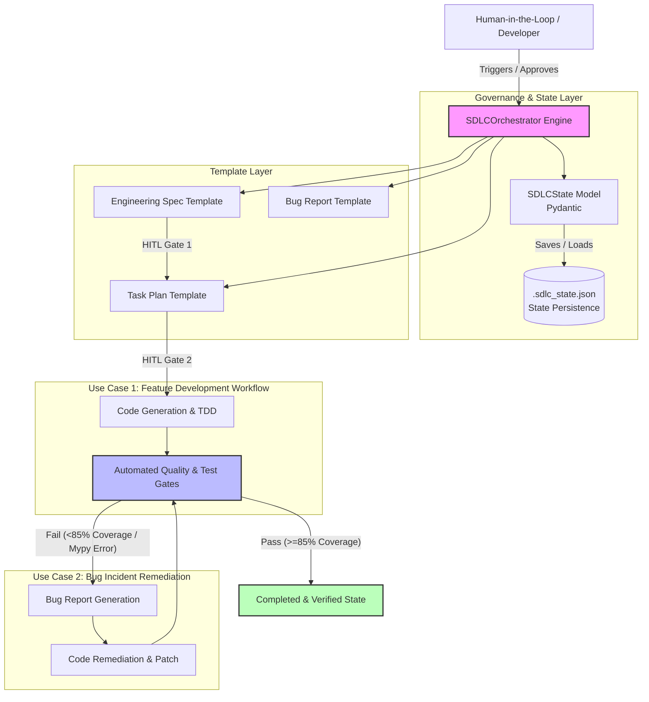

# Agentic SDLC Orchestrator & Templates Documentation

**Agentic SDLC Orchestrator** is an automated product management pipeline designed to enforce a strict separation between high-level, value-driven strategy documents and technical code generation. This documentation details the core orchestration script and the modular template architecture housed within the workflow directory.

---

**Directory Structure**

```text
agentic-pm-sdlc/
├── workflows/                          # Core orchestration engine and governance templates
│   ├── templates/                      # Source-of-truth governance contracts & templates
│   │   ├── architecture.md
│   │   ├── bug_report_template.md
│   │   ├── code_template.py
│   │   ├── discovery.md
│   │   ├── discovery_template.md
│   │   ├── engineering_spec_template.md
│   │   ├── prd.md
│   │   ├── prd_template.md
│   │   ├── strategy.md
│   │   ├── strategy_template.md
│   │   ├── task_plan_template.md
│   │   └── test_template.py
│   └── orchestrator.py                 # Pydantic state-machine & workflow runner
└── readme.md                           # Project documentation & architecture overview

```
---
## 📐 Architecture & Governance Framework

The Agentic PM & SDLC Governance Framework enforces a strict "Product-First" contract model. It utilizes an orchestrator-driven state machine combined with mandatory Human-in-the-Loop (HITL) checkpoints and automated quality gates to ensure code generation meets strict quality ($\ge 85\%$ test coverage via `pytest-cov`) and type-safety (`mypy`) standards.


---

**Orchestrator Overview (`orchestrator.py`)**

The orchestrator script manages the automated compilation of feature requests into structured product documentation.

* **Dynamic Variable Injection**: Injects target feature requests into standardized Markdown templates.
* **Directory Management**: Automatically provisions structured output directories (`documents/` and `prds/`) for each distinct project workspace.
* **Human-in-the-Loop (HITL) Gates**: Halts execution at the end of each lifecycle phase, prompting interactive terminal sign-off before proceeding to the next artifact.
* **Pipeline Decoupling**: Enforces complete separation between product definition phases and future engineering/code implementation steps.

---

**Template Specifications (`workflows/templates/`)**

Each template inside the directory serves a precise methodological function within the product lifecycle:

* **`strategy_template.md` (RISE Framework)**
* *Focus*: Strategic planning and risk assessment.
* *Sections*: Executive Summary & Strategic Alignment, RISE Evaluation Matrix (Relevance, Impact, Strategic Fit, Effort), and Pre-Mortem Risk Analysis.


* **`discovery_template.md` (PACT Framework)**
* *Focus*: User research and contextual environment mapping.
* *Sections*: Target Audience & Personas, Activities & Jobs-to-be-Done (JTBD), and Operational Context & Constraints.


* **`prd_template.md` (Merged PostHog / Atlassian Model)**
* *Focus*: Detailed feature requirements and traceability.
* *Sections*: Executive Summary & Problem Context, Target Audience & Scope, Success Metrics & KPIs, Functional Requirements & User Stories Matrix, Key User Flows & Edge Cases, and Assumptions & Open Questions Log.


---

**Execution Workflow**

1. Activate the python environment and navigate to the working directory.
2. Run the orchestrator script to initialize the documentation pipeline:
```bash
python workflows/orchestrator.py

```


3. Input the target feature request or accept the default prompt (e.g., the LLM Evaluator module).
4. Review generated markdown files interactively at each **Product HITL Gate** before approving completion.		
